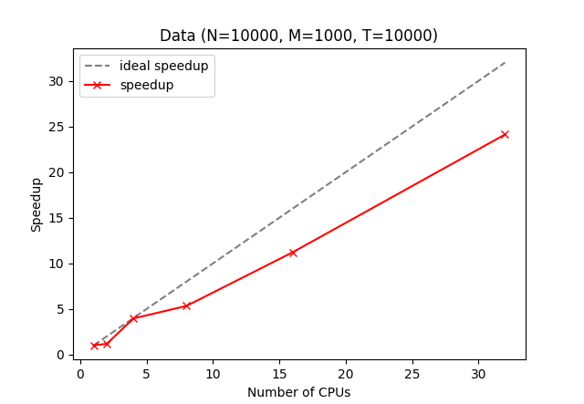
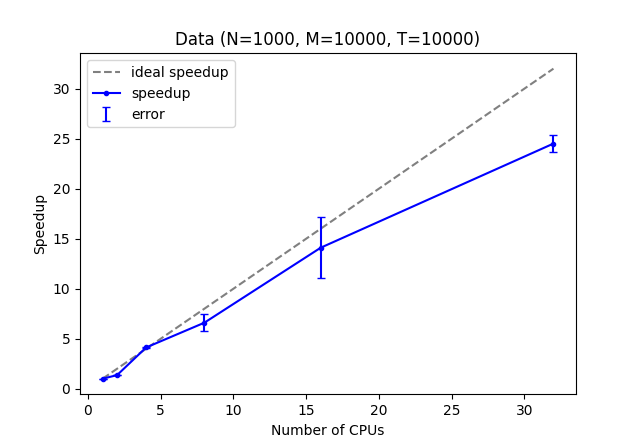
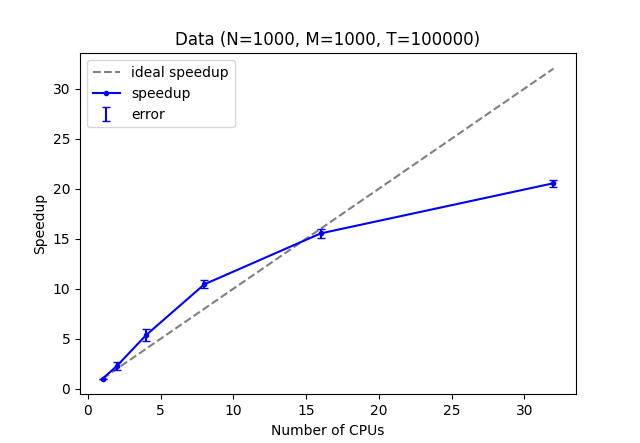

# Projet - L'équation de la chaleur

#### Figure 1

#### Figure 2

#### Figure 3

##### Méthode:

Ici nous avons fait des mesures pour le temps séquentiel (1cpu), ainsi que 2, 4, 8, 16 et 32 cpus pour les temps parallèles. Nous avons multiplié par 5 les mesures et représenté leur moyenne dans ces graphes.

Nous avons choisis un même volume de données de 10¹¹. Ceci nous a permis d'avoir des temps de calculs entre la minute et la demi heure pour le nombre de cpus ci-dessus.

De plus, nous pouvons comparer plus rigoureusement l'influence des paramètres modifiant le nombre de données (calculés par N * M * T) pour ce même volume.

##### Analyse:

​	Nous observons un speedup (Ts/Tp) très performant, s'approchant du speedup ideal pour les figures 1 et 2. 

Le speedup de la figure 3 dépasse le speedup idéal pour des valeurs CPU de 4 et 8. Ceci est étrange car la loi d'Amdahl définit le speedup ideal comme étant un maximum et donc physiquement infranchissable.

La courbe infléchit rapidement ce qui serait expliquable par l'overhead de communication.

